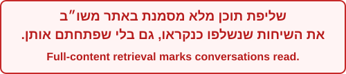
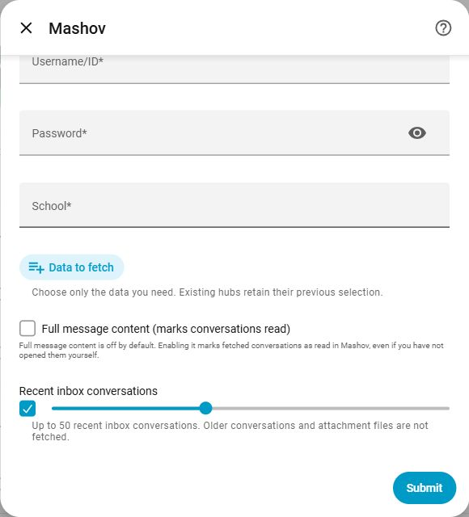
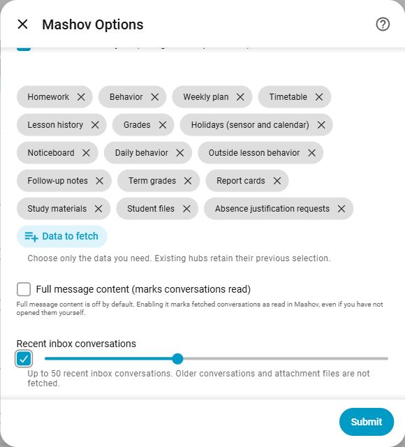

[**English**](README.md) · [**עברית**](README.he.md)

# משו״ב — אינטגרציה ל־Home Assistant באמצעות HACS

אינטגרציה קהילתית ולא רשמית למשו״ב. מציגה מידע מבית הספר ב־Home Assistant ומאפשרת לבחור מה לשלוף לכל חשבון ומוסד.

**גרסה נוכחית: v1.1.0 · נדרש Home Assistant 2025.3 ומעלה.**

**v1.1.0** כוללת זמני משיכה לכל תלמיד ולכל סוג מידע, ועורך בתוך טפסי ההקמה וההגדרה. עדכנו דרך HACS והפעילו מחדש את Home Assistant.

הפרויקט אינו קשור לחברת משו״ב. ראו [הערות גרסה](RELEASE_NOTES.md) ו[יומן שינויים](CHANGELOG.md).

## התקנה מהירה

1. פתחו **HACS → Integrations → ⋯ → Custom repositories**. הוסיפו `https://github.com/NirBY/ha-mashov` בקטגוריית **Integration**.
2. התקינו את Mashov והפעילו מחדש את Home Assistant.
3. פתחו **הגדרות → מכשירים ושירותים → הוספת אינטגרציה → Mashov**, הזינו פרטי כניסה ובחרו מוסד.
4. בחרו **סוגי מידע לשליפה** ולחצו **שליחה**. אפשר לשנות את הבחירה בהמשך דרך **הגדרה / Configure**.

> **בחירה ריקה לא יוצרת חיישני מידע.** הדשבורד וה־blueprints זקוקים לקטגוריות המתאימות. להתחלה עם מידע בסיסי בחרו שיעורי בית, התנהגות, תכנון שבועי, מערכת שעות, היסטוריית שיעורים וציונים. הוסיפו חופשות עבור לוח השנה ואוטומציות שמתחשבות בחופשות.

להתקנה ידנית, העתיקו את `custom_components/mashov` לתיקיית `/config/custom_components/mashov` ב־Home Assistant והפעילו מחדש.

## בחירת המידע — מה זמין ומה מופעל כברירת מחדל

גם בהוספת חשבון, עורך התזמונים נמצא בתוך חלק **זמני משיכה** בטופס עצמו. הזינו פרטי חשבון, בחרו מידע ועדכנו תזמון כללי או תזמון לכל סוג. לחיצה אחת על **שליחה** שומרת את כל ההגדרות. התלמידים זמינים לאחר ההתחברות ושליפת הרשימה. ההקמה וההגדרה משתמשות בשפת Home Assistant.

בחרו **תלמיד** בעורך האינטראקטיבי כדי להגדיר את זמני המשיכה שלו. **כללי** הוא תזמון ברירת המחדל של אותו תלמיד; לכל סוג מידע אפשר לקבוע זמן אחר. המעבר בין תלמידים שומר טיוטות, ולחיצה אחת על **שמירה** שומרת את כל התלמידים בחשבון שנבחר. בשדרוג נשמרים זמני המשיכה הקיימים עד שמגדירים תזמון אישי. הרענון פונה רק לנתונים של התלמיד שהגיע זמנו ומשאיר את נתוני האחים וחותמות הזמן שלהם ללא שינוי. רענון ידני עדיין מעדכן את כל המידע שנבחר. התזמונים מזוהים לפי מזהה תלמיד קבוע; שינוי שם אינו מחליף ביניהם. תלמיד חדש יורש את ברירות המחדל הקיימות.

חופשות שייכות לבית הספר ותיבת הדואר לחשבון. לעריכתן בחרו **מידע משותף לחשבון ולבית הספר וברירות מחדל**. בהקמה נשמרות תחילה ברירות המחדל; לאחר אימות החשבון וטעינת רשימת התלמידים אפשר להגדיר כל תלמיד בנפרד.

### תזמון נפרד לכל סוג מידע — v1.1.0

בהקמה ובהגדרה טבלת כל 18 סוגי המידע נמצאת בחלק ״התזמונים הנוכחיים״, הסגור כברירת מחדל. לחצו לפתיחה כדי לראות מצב הפעלה ותזמון בפועל. השדות מחולקים לנתונים, תזמון, חשבון והגדרות מתקדמות. כברירת מחדל כולם משתמשים בתזמון המשותף הקיים.

לעריכה, פתחו **תזמוני רענון** בתוך טופס ההגדרה. בחרו **תלמיד**, ואז **כללי** או סוג מידע. השדות משתנים לפי התזמון: שעה ביומי, שעה וימים בשבועי, דקות במרווח קבוע (5–1440). בטלו את סימון הירושה כדי להגדיר תזמון אישי. המעבר בין תלמידים וסוגים שומר את הטיוטה; **שליחה** בתחתית הטופס שומרת את כולם יחד. ביטול הטופס משאיר את ההגדרות השמורות ללא שינוי.

השעות לפי אזור הזמן של Home Assistant. מידע כבוי אינו נשלף גם אם הוגדר לו תזמון. סוגים עם אותו תזמון נשלפים יחד; רענון ממוקד שומר את הנתונים ואת זמן העדכון של יתר הסוגים. רענון ידני והשלמת מטמון ראשונית עדיין שולפים את כל המידע שנבחר.

הגדרות מגרסאות קודמות — לרבות תזמון שבועי עם יום יחיד — שומרות על ההתנהגות הקיימת ללא מחיקה והוספה של החשבון. תזמון משותף ב־YAML ממשיך לגבור על התזמון המשותף בטופס; תזמונים נפרדים נשארים עצמאיים. מרווחים קצרים מגדילים את מספר הבקשות ועלולים לגרום ליותר הודעות פעילות ממשו״ב.

אפשר להגדיר גם דרך `mashov.set_options` עם `data_schedules`; ראו [דוגמה באנגלית](README.md#separate-schedules-for-each-data-type-local-preview). המפה מחליפה את כל התזמונים הנפרדים; `{}` מחזיר את כולם לתזמון המשותף.

כל פעולות הרענון בכל חשבונות משו״ב משתמשות בתור משותף. רענון מתוזמן או ידני ממתין עד לסיום הרענון הפעיל. בטעינה מחדש של חשבון ממתינים לסיום הבקשה הפעילה ומדלגים על הבקשות שלו שממתינות בתור לפני סגירת החיבור.

**בהתקנה חדשה כל 18 הקטגוריות כבויות.** בוחרים ידנית רק את המידע הדרוש, בהגדרה הראשונית או בהגדרות האינטגרציה בהמשך. בחירת הקטגוריות חלה על כל התלמידים באותו חשבון ובאותו מוסד. חופשות הן ברמת המוסד ותיבת הדואר היא ברמת החשבון.

**בעדכון נשמרת הבחירה הקודמת.** במעבר מגרסאות 1.0.7–1.0.15, שבע קטגוריות הבסיס שהיו פעילות ממשיכות לפעול, ונשמרים גם סוגי המידע הנוספים שבחרתם. מי שהוסיף חשבון ב־1.0.15 עם לוח מודעות פעיל ממשיך לקבל אותו. החל מ־1.0.16 נשמרת גם בחירה ריקה או חלקית. עדכון אינו מפעיל תיבת דואר, תוכן מלא או שעות פרטניות. מזהי הישויות, השמות וההתאמות האישיות נשמרים; ישות שהמשתמש השבית ידנית נשארת מושבתת.

| קטגוריה / שם באנגלית | מה מתקבל | חשבון חדש | שדרוג מ־1.0.7–1.0.15 |
| ---: | ---: | ---: | ---: |
| שיעורי בית / Homework | מטלות בחלון התאריכים שנבחר (`homework`) | כבוי — בחירה ידנית | בסיס — נשאר פעיל |
| התנהגות / Behavior | אירועי התנהגות בחלון התאריכים (`behavior`) | כבוי — בחירה ידנית | בסיס — נשאר פעיל |
| תכנון שבועי / Weekly plan | תכנון שיעורים שפורסם (`weekly_plan`) | כבוי — בחירה ידנית | בסיס — נשאר פעיל |
| מערכת שעות / Timetable | מערכת שבועית (`timetable`) | כבוי — בחירה ידנית | בסיס — נשאר פעיל |
| היסטוריית שיעורים / Lesson history | יומן שיעורים שהשרת מחזיר (`lessons_history`) | כבוי — בחירה ידנית | בסיס — נשאר פעיל |
| ציונים / Grades | רשימת ציונים (`grades`) | כבוי — בחירה ידנית | בסיס — נשאר פעיל |
| חופשות / Holidays | חיישן חופשות וישות לוח שנה (`holidays`) | כבוי — בחירה ידנית | בסיס — נשאר פעיל |
| לוח מודעות / Noticeboard | הודעות כלליות מבית הספר ותאריכי תפוגה (`message_board`) | כבוי — בחירה ידנית | נשמרת הבחירה הקודמת, כולל ברירת המחדל של חשבון שנוצר ב־1.0.15 |
| התנהגות יומית / Daily behavior | רשומות יומיות בחלון התאריכים (`daily_behavior`) | כבוי — בחירה ידנית | נשמרת הבחירה הקודמת |
| התנהגות מחוץ לשיעור / Outside lesson behavior | אירועים מחוץ לשיעורים בחלון התאריכים (`outside_behavior`) | כבוי — בחירה ידנית | נשמרת הבחירה הקודמת |
| הערות מעקב / Follow-up notes | הערות צוות בחלון התאריכים (`follow_up`) | כבוי — בחירה ידנית | נשמרת הבחירה הקודמת |
| ציונים תקופתיים / Term grades | ציונים לפי תקופה (`periodic_grades`) | כבוי — בחירה ידנית | נשמרת הבחירה הקודמת |
| תעודות / Report cards | רשומות תעודות; ללא הורדת קבצים (`report_cards`) | כבוי — בחירה ידנית | נשמרת הבחירה הקודמת |
| חומרי לימוד / Study materials | רשומות חומרי לימוד; ללא הורדת קבצים (`study_materials`) | כבוי — בחירה ידנית | נשמרת הבחירה הקודמת |
| קובצי תלמיד / Student files | רשומות קבצים; ללא הורדת הקבצים עצמם (`student_files`) | כבוי — בחירה ידנית | נשמרת הבחירה הקודמת |
| בקשות להצדקת היעדרות / Absence justification requests | בקשות קיימות בחלון התאריכים; לא מגיש בקשות (`justification_requests`) | כבוי — בחירה ידנית | נשמרת הבחירה הקודמת |
| שעות פרטניות / Individual lessons | רשומות שיעורים פרטניים שהמוסד מפרסם (`special_hours`) | כבוי — בחירה ידנית | כבוי — נוסף ב־1.0.16 |
| תיבת דואר / Mailbox — headers and unread count | מספר שיחות שלא נקראו וכותרות השיחות האחרונות, ללא סימון כנקראו (`mailbox`) | כבוי — בחירה ידנית | כבוי — נוסף ב־1.0.16 |
| ↳ תוכן מלא של הודעות / Full message content | תוספת לתיבת הדואר: גוף ההודעות כטקסט בלבד, ללא קבצים מצורפים.  | כבוי — דורש סימון נפרד | כבוי — דורש הסכמה מפורשת |

זמינות המידע תלויה בהרשאות המוסד. חוסר הרשאה מוצג כ־`unknown` עם `source_status: forbidden` או `unsupported`; מקור תקין ללא רשומות מציג `0`. לוח המודעות נפרד מתיבת הדואר. שאלונים, אישורי הורים, שליחת הודעות, טיוטות, ארכיון וקבצים מצורפים אינם נתמכים כרגע.

### איך בוחרים בהתקנה ראשונית

1. לאחר התקנה דרך HACS והפעלה מחדש: **הגדרות → מכשירים ושירותים → הוספת אינטגרציה → Mashov** (בממשק אנגלי: **Settings → Devices & services → Add integration → Mashov**).
2. הזינו משתמש, סיסמה ומוסד. בשדה **סוגי מידע לשליפה / Data to fetch** פתחו את הרשימה ובחרו קטגוריה. חזרו על הפעולה לכל קטגוריה נוספת. קטגוריה שנבחרה מופיעה כתגית; לחיצה על **×** מסירה אותה. הרשימה מציגה רק קטגוריות שעדיין לא נבחרו.
3. לתיבת דואר בחרו **Mailbox — headers and unread count**. רק אם דרוש גוף ההודעות, סמנו בנפרד **שליפת תוכן מלא של הודעות / Full message content (marks conversations read)**, לאחר קריאת האזהרה. מספר השיחות האחרונות הוא **20 כברירת מחדל**, בטווח **1–50**.
4. לחצו **שליחה / Submit**. אין צורך להוסיף חיישנים ידנית: נוצרות ישויות לסוגים שנבחרו. שמירה בלי בחירה לא יוצרת חיישני מידע; החשבון עדיין מתחבר ומזהה את התלמידים.



### איך משנים חשבון קיים לאחר עדכון

1. עדכנו דרך HACS והפעילו מחדש את Home Assistant.
2. פתחו **הגדרות → מכשירים ושירותים → Mashov**, ולחצו על גלגל השיניים **הגדרה / Configure** ליד המוסד הרצוי. אין צורך למחוק ולהוסיף מחדש את האינטגרציה.
3. התגיות מציגות את הבחירה הקיימת. הוסיפו דרך **סוגי מידע לשליפה / Data to fetch** והסירו באמצעות **×**. בחשבונות מרובים מגדירים כל חשבון בנפרד.
4. לחצו **שליחה / Submit**. שינוי קטגוריות, תוכן מלא או מגבלת השיחות טוען מחדש את החשבון ומנסה לרענן מיד. לאחר מכן פועל לוח הרענון הקיים — ברירת המחדל היא כל יום ב־14:00. בקשת מידע שמוסד חסם עשויה להמתין לתום ההשהיה של אותו מקור.



הצילומים מציגים את השדות בממשק האנגלי של Home Assistant. צולמו מתוך הטפסים עצמם, ללא פרטי כניסה או שמות תלמידים; פתיחת הטופס לצילום אינה משנה את ההגדרות.

### מה קורה בכיבוי וכמה זמן המידע נשמר

| פעולה / מקום שמירה | מה קורה בפועל |
| ---: | ---: |
| הסרת קטגוריה ולחיצה על Submit | לאחר טעינה מחדש נעצרות הבקשות למקור הזה. נתוניו מוסרים מהמטמון הפעיל ומהקובץ המקומי **לפני ניסיון התחברות**, גם אם משו״ב אינו זמין. הישויות מושבתות אך מזהיהן ושמותיהן נשמרים להפעלה חוזרת. כרטיס ידני שמפנה אליהן עשוי להציג „לא זמין”. |
| כיבוי תוכן מלא בלבד | גופי ההודעות נמחקים מהמטמון הפעיל ומהקובץ המקומי; כותרות וספירת שיחות ממשיכות להתעדכן אם תיבת הדואר נבחרה. הודעות שכבר סומנו באתר כנקראו אינן חוזרות למצב „לא נקרא”. |
| הסרת תיבת הדואר | מוסרת גם את הכותרות מהמטמון ומאפסת את סימון התוכן המלא. הוספת תיבת הדואר מחדש מתחילה בכותרות בלבד. |
| השבתת ישות ידנית במסך Entities | אינה משנה את בחירת הקטגוריה ואינה עוצרת את שליפתה עבור החשבון. להפסקת שליפה יש להסיר את הקטגוריה מתוך Configure. |
| השבתת כל חשבון האינטגרציה דרך התפריט | עוצרת את הפעילות, אך משאירה את המטמון וההזדהות להפעלה חוזרת. להסרת הנתונים מהמטמון יש לבטל קטגוריות ולשמור לפני ההשבתה, או למחוק את חשבון האינטגרציה. |
| בחירה ריקה | אין בקשות לקטגוריות המידע. רשימת התלמידים וההזדהות נשמרות לצורך החשבון; זו אינה מחיקה של החשבון. |
| המטמון של האינטגרציה | נשמרת תמונת המצב האחרונה, **ללא מספר ימים קבוע וללא מחיקה לפי גיל**. רענון מוצלח מחליף אותה; כשל יכול להשאיר נתונים קודמים ללא הגבלת זמן עם סימון מידע לא עדכני. כיבוי קטגוריה מסיר אותה מהמטמון בטעינה מחדש. מחיקת חשבון האינטגרציה מוחקת את קובץ המטמון וההזדהות שלו. |
| כותרות ותוכן תיבת הדואר | עד מספר השיחות שנבחר, כברירת מחדל 20; זו מגבלת כמות ולא זמן. הקטנת המספר מצמצמת גם את המטמון בטעינה מחדש. אין תאריך תפוגה נפרד לתוכן שנשאר במטמון. |
| חלון תאריכים | שיעורי בית, התנהגות והמקורות שמסומנים בטבלה ככאלה משתמשים כברירת מחדל ב־7 ימים אחורה ו־21 קדימה. זהו חלון בקשה מהשרת, **לא מחיקת היסטוריה**. יתר המקורות תלויים במה שמשו״ב מחזיר לשנת הלימודים. |
| היסטוריית Home Assistant | נשמרת בנפרד לפי Recorder. ברירת המחדל של HA היא **10 ימים** וניקוי אוטומטי מדי לילה; הגדרה אישית יכולה להיות ארוכה יותר או לבטל ניקוי. ימי ההיסטוריה נספרים מזמן רישום מצב החיישן, לא מתאריך ההודעה; הודעה ישנה שנשלפת שוב עשויה להירשם שוב. ביטול קטגוריה או מחיקת חשבון אינם מוחקים היסטוריה שכבר נרשמה, כולל טקסט הודעות שנשמר לפני תיקון הפרטיות. לאחר התיקון `items` מוחרג מרישום עתידי. ראו [תיעוד Recorder](https://www.home-assistant.io/integrations/recorder/). |
| גיבויים, ייצוא ואוטומציות | עותקים בגיבויי HA/NAS, בקבצים או בהודעות שאוטומציה שלחה נשמרים לפי המדיניות שלהם. כיבוי באינטגרציה אינו מוחק אותם. המידע באתר משו״ב עצמו אינו נמחק. |

לאחר תיקון הפרטיות, תוכן הודעות מוחרג אוטומטית מרישום עתידי. אפשר להחריג גם את החיישן כולו באמצעות `recorder.exclude.entities`, כמפורט בהמשך. ההחרגה אינה מוחקת היסטוריה קיימת ואינה מבטלת את המטמון הנוכחי.

## פרטיות וגישה לתיבת הדואר

> **משתמשי Home Assistant, כולל ילדים עם חשבון שאינו מנהל, יכולים לקרוא את מאפייני חיישן הדואר.** הסתרת כרטיס בדשבורד אינה מגבילה גישה לישויות. תיקון הפרטיות בעותק העבודה מחריג אוטומטית את `items` (כותרות וגופי הודעות) מרישום עתידי ב־Recorder; היסטוריה קיימת אינה נמחקת. הפעילו תיבת דואר רק אם המידע מתאים לכל מי שיש לו גישה למערכת שלכם.

להחרגת החיישן כולו, כולל ספירת הודעות ומאפיינים טכניים, מרישום עתידי, שלבו את ההגדרה הבאה בהגדרת `recorder` הקיימת ב־`configuration.yaml`, החליפו במזהה החיישן בפועל והפעילו מחדש:

```yaml
recorder:
  exclude:
    entities:
      - sensor.REPLACE_WITH_YOUR_MAILBOX_ENTITY_ID
```

ההחרגה אינה מוחקת היסטוריה קיימת, מטמון או גיבויים, ואינה מונעת קריאה של מצב החיישן הנוכחי.

## ישויות, רענון ואפשרויות

לכל תלמיד נוצרות ישויות רק עבור הקטגוריות שנבחרו. מצב החיישן הוא בדרך כלל מספר הרשומות; המאפיין `items` מכיל נתונים לשימוש בכרטיסים ובאוטומציות. חופשות כוללות חיישן ולוח שנה לכל מוסד, ותיבת הדואר שייכת לחשבון.

- רענון יומי: **14:00** כברירת מחדל; ניתן לשנות זמן וסוג תזמון.
- חלון תאריכים: **7 ימים אחורה ו־21 קדימה** כברירת מחדל.
- מגבלת רשומות במאפיינים: **100**, בטווח **10–500**. זו מגבלת תצוגה, ולא מחיקת המטמון או ההיסטוריה.
- `source_status` מציג את מצב המקור; `data_stale: true` מציין מידע קודם לאחר כשל רענון.
- שנת הלימודים מתקדמת אוטומטית ב־1 בספטמבר. חשבון עם שנה קבועה דורש הפעלת **שנת לימודים אוטומטית** ב־Configure.
- עדכון סיסמה ב־Configure חל רק על החשבון שנבחר.

שליפת מידע בלילה עשויה לגרום להודעות התחברות ממשו״ב. אם הדבר מפריע, הגדירו רענון בשעות היום.

## דשבורד ואוטומציות מוכנות

| כלי | מה הוא עושה | קטגוריות נדרשות |
| --- | --- | --- |
| [משו״ב לייב](blueprints/script/mashov/mashov_live_dashboard.yaml) | יוצר דשבורד בעברית עם תמונות, כרטיסי תלמידים וחלוניות מידע; דורש Bubble Card 3.4 ומעלה ודשבורד UI ריק | הקטגוריות שתרצו להציג |
| [הקראת שיעורי בית והתנהגות](blueprints/automation/mashov/mashov_daily_homework_announce.yaml) | הקראה בעברית, כברירת מחדל ב־15:00 | שיעורי בית, התנהגות וחופשות |
| [תזכורת להכנת תיק](blueprints/automation/mashov/bag_reminder_tomorrow.yaml) | מקצועות למחר, כברירת מחדל ב־18:00 | מערכת שעות וחופשות; תכנון שבועי לבחירה |
| [הודעה חדשה בלוח המודעות](blueprints/automation/mashov/mashov_noticeboard_announce.yaml) | התראה והקראה לבחירה; ללא הקראה בין 22:00 ל־07:00 | לוח מודעות — יש לבחור ב־Data to fetch |

הודעות מגיעות בעת הרענון, ולא בזמן אמת. בחשבונות חדשים לוח המודעות כבוי; חשבונות שנוצרו ב־1.0.15 שומרים את הבחירה הקודמת. ה־blueprint ממתין לתחילת ניגון ולאחר מכן לסיומו, עד לזמן ההמתנה שהוגדר לכל שלב (120 שניות כברירת מחדל). פקיעת הזמן מאפשרת החזרת עוצמה גם אם הרמקול אינו מדווח מצב תקין.


יש לבחור בני משפחה המקושרים למשתמש HA. נראות כרטיסים אינה הרשאת גישה לנתונים. יצירה חוזרת של דשבורד שנוצר באינטגרציה מחליפה גם עריכות ידניות שלו. ראו [הוראות ייבוא והגדרה מפורטות באנגלית](README.md#-script-blueprint-mashov-live-dashboard-bubble-card) ו[דוגמאות Lovelace](examples/lovelace/README.md).

## פעולות

לרענון מיידי של כל החשבונות:

```yaml
action: mashov.refresh_now
```

ניתן להעביר `entry_id` לרענון חשבון מסוים. הפעולה `mashov.set_options` מעדכנת אפשרויות; ללא `entry_id` היא פועלת על החשבון הראשון שנטען. הפעולה `mashov.create_live_dashboard` יוצרת דשבורד וזמינה למנהלים בלבד. ראו [דוגמאות ופרמטרים מלאים](README.md#-services).

## פתרון תקלות

- **אין חיישנים:** בדקו שנבחרו קטגוריות ב־Configure. אין צורך להוסיף חיישנים ידנית.
- **שגיאת הזדהות / 401:** בדקו פרטי כניסה ומוסד ועדכנו דרך Configure.
- **מקור חסום / 403:** ייתכן שהמוסד אינו מאפשר את המידע. האינטגרציה משהה ניסיונות חוזרים; אין להסיק מכך שהסיסמה שגויה.
- **מידע לא עדכני:** בדקו את `last_update` ואת `data_stale`, ונסו רענון ידני. מטמון עשוי להישאר כשמשו״ב אינו זמין.
- **מוסד אינו ברשימה:** חפשו לפי שם או סמל מוסד; אם הרשימה אינה נטענת, השתמשו בשדה הטקסט החלופי.
- **תלמיד שעזב:** לאחר רענון, אפשר למחוק מכשיר של תלמיד שאינו ברשימת החשבון. מחיקת כרטיס בדשבורד אינה מוחקת מכשיר או היסטוריה.

תקלות התחברות ורענון מוצגות בהתראה ב־HA. קישור לדיווח GitHub מוצע עבור שגיאות פנימיות ומצריך בדיקה ושליחה שלכם; דבר אינו נשלח אוטומטית. סשן שנסגר בזמן שליפת דואר מטופל ככשל שליפה תפעולי; שגיאות פנימיות אחרות נשארות ניתנות לדיווח.

להפעלת לוג מפורט:

```yaml
logger:
  logs:
    custom_components.mashov: debug
```

לפני שיתוף לוגים, צילומים או דיאגנוסטיקה, הסירו פרטי כניסה, מזהים, שמות תלמידים, ציונים, תוכן הודעות, עוגיות וטוקנים. אל תשתפו את קובץ `.storage/mashov.<entry_id>.cache`: הוא מכיל נתונים והזדהות. דיאגנוסטיקה כוללת מצבים וספירות טכניות ללא תוכן דואר.

## שדרוג, פיתוח ורישיון

עדכנו דרך HACS והפעילו מחדש. אין צורך למחוק ולהוסיף את החשבון. [הערות הגרסה](RELEASE_NOTES.md), [יומן השינויים](CHANGELOG.md) ו[הנחיות התרומה](CONTRIBUTING.md) מפרטים תאימות, תיקונים ופיתוח.

רישיון [MIT](LICENSE); ראו גם [הודעת הפרויקט](NOTICE.md).
