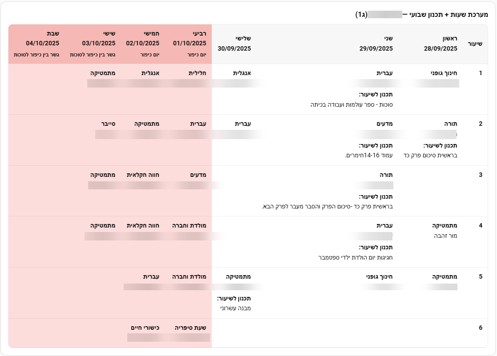
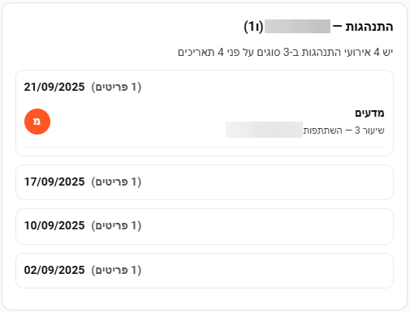
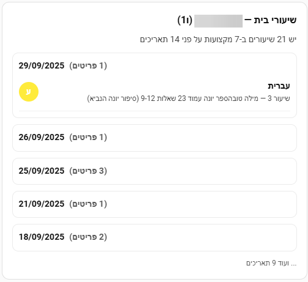

# Mashov – Home Assistant Integration (HACS)

Unofficial integration for **משו"ב (Mashov)** that logs into the student portal and exposes data as sensors:
- **Weekly Plan**
- **Homework**
- **Behavior**
- **Timetable** (weekly timetable per student)
- **Lessons History** (historical lessons/logs per student)
- Global **Holidays** (school holidays calendar)

> This project is **community-made** and not affiliated with Mashov. Use at your own risk and follow your school's policies.

---


## 🧩 Features
- Simple **Config Flow (UI)** via Settings → Devices & Services → Add Integration → **Mashov**.
- **Daily refresh** (02:30 by default) + `mashov.refresh_now` service for on-demand updates.
- Sensors expose compact **state** (count) + rich **attributes** (lists you can use in automations / dashboards).
- **Diagnostics** endpoint for safe issue reporting (redacts credentials).

---

## 📦 Installation

### Via HACS (recommended)
1. Open **HACS → Integrations → ⋯ → Custom repositories**.
2. Add repository URL: `https://github.com/NirBY/ha-mashov`. Select **Category: Integration**.
3. Search for **Mashov** in HACS, install, and **Restart Home Assistant**.

### Manual
1. Copy `custom_components/mashov` into your HA `/config/` folder.
2. Restart Home Assistant.

> The integration includes custom `icon.png` and `logo.png` for better visuals in Home Assistant.

---

## ⚙️ Configuration

1. **Add Integration → Mashov**.
2. Enter **username / password**.
3. Pick your **school** from the dropdown with **fast autocomplete** (type to filter). If the list doesn't load, a text field appears; type the **school name in Hebrew** or the **Semel** and we'll resolve it.
4. Done — sensors for **each child** will be created.

### Options
- **Homework window**: days back (default 7), days forward (default 21)
- **Daily refresh time**: default `02:30`
- **API base**: default `https://web.mashov.info/api/` (override if your deployment differs)

#### Important note about night-time polling
- Pulling data at night may trigger email notifications from Mashov about account activity/logins. If this is undesirable:
  - Prefer scheduling the daily/weekly refresh to daytime hours (e.g., `14:00`).
  - Use the Options screen or YAML to set `schedule_type` and `schedule_time` accordingly.
  - Avoid long-running `interval` mode during overnight hours.

### Configuration via configuration.yaml (optional)
You can also configure the refresh schedule via YAML. Values in YAML override the Options UI.

```yaml
mashov:
  # Scheduling
  schedule_type: daily        # daily | weekly | interval
  schedule_time: "14:00"      # for daily/weekly
  schedule_day: 0             # 0=Monday ... 6=Sunday
  schedule_days: [0, 2, 4]    # optional multiple days for weekly
  schedule_interval: 120      # minutes (for interval mode)

  # Other (optional)
  homework_days_back: 7
  homework_days_forward: 21
  api_base: "https://web.mashov.info/api/"
```

---

## 🧠 Entities (per child)

For each child **N**, these sensors are created:

- **Weekly Plan** – `sensor.mashov_<student_id>_weekly_plan`
- **Homework** – `sensor.mashov_<student_id>_homework`
- **Behavior** – `sensor.mashov_<student_id>_behavior`
- **Timetable** – `sensor.mashov_<student_id>_timetable`
- **Lessons History** – `sensor.mashov_<student_id>_lessons_history`

**State** = number of items.  
**Attributes** (common): `items`, `formatted_summary`, `formatted_by_date`, `formatted_by_subject` (and for timetable: also table helpers).

> Tip: Use `{ state_attr('sensor.mashov_<id>_homework', 'items') }` to access raw lists.

### Global Entities
- **Holidays** – `sensor.mashov_holidays`  
  State = number of holidays. Attributes: `items`, `formatted_summary`, `formatted_by_date`.

---

## 🔔 Automation Blueprint: Daily Homework & Behavior Announcement

הוספנו Blueprint אוטומציה המקריא בעברית את שיעורי הבית וההתנהגות של היום בשעה קבועה, עם שמירה על ווליום ועוד.

ייבוא בלחיצה (My Home Assistant):

[](https://my.home-assistant.io/redirect/blueprint_import/?blueprint_url=https%3A%2F%2Fraw.githubusercontent.com%2FNirBY%2Fha-mashov%2Fmain%2Fblueprints%2Fautomation%2Fmashov%2Fmashov_daily_homework_announce.yaml)

קובץ ה-Blueprint נמצא ב-`blueprints/automation/mashov/mashov_daily_homework_announce.yaml`.

מה עושה האוטומציה?
- Daily voice announcement at **15:00** that reads the student’s **name**, **today’s behaviors**, and **today’s homework** (Hebrew).
- Runs **only in daytime** and **skips holidays** using your Mashov holidays sensor (`Items[start/end]`).
- Triggers **only if there is data for today** in the homework and/or behavior sensors.
- Temporarily **sets the speaker to max volume**, speaks via **`tts.speak`** (configurable), then **restores the original volume** after playback.
- Works with any `media_player` (Sonos, Nest, etc.); volume restore is state-aware.
- Fully **templated blueprint**: select your own Mashov sensors and speaker at import time.
- Safe defaults: 15:00 schedule, Hebrew (`he-IL`) TTS, 07:00–22:00 guard rails.
- GitHub-friendly: no hardcoded entity IDs; can be imported with a **My Home Assistant** one-click link.

כיצד להשתמש?
1. לחצו על כפתור הייבוא למעלה והשלימו את הבחירה של `holiday_sensor`, `homework_sensor`, `behavior_sensor`, `media_player` ו-`tts_service` אם תרצו.
2. שמרו את האוטומציה. ברירת המחדל תרוץ מדי יום ב-15:00.

---

## 🛠️ Services

### `mashov.refresh_now`
Trigger an immediate refresh.
```yaml
service: mashov.refresh_now
data:
  entry_id: YOUR_ENTRY_ID  # optional; if omitted, all entries refresh
```

Calling without `entry_id` refreshes all configured Mashov hubs.

---

## 🧱 Lovelace Cards (Examples)
You can quickly add cards to display Mashov data. Use `!include` to import ready-made cards.

Files:
- `examples/lovelace/cards/weekly_plan_table_advanced.yaml`
- `examples/lovelace/cards/behavior_list_by_date.yaml`
- `examples/lovelace/cards/homework_list_by_date.yaml`
- `examples/lovelace/cards/refresh_all_button.yaml`

Copy these files into your Home Assistant config at `/config/lovelace/cards/examples/`, then reference them like this:

Note: HACS installs only `custom_components/`. Copy the example card files to your `/config/examples/` (or paste the YAML into UI cards) if you want to use `!include`.

Advanced weekly plan (table) via include:
```yaml
views:
  - title: Mashov
    cards:
      - !include lovelace/cards/examples/weekly_plan_table_advanced.yaml
```
Example preview:

<p align="left"></p>

Behavior events grouped by date:
```yaml
views:
  - title: Mashov
    cards:
      - !include lovelace/cards/examples/behavior_list_by_date.yaml
```
Example preview:

<p align="left"></p>

Homework grouped by date:
```yaml
views:
  - title: Mashov
    cards:
      - !include lovelace/cards/examples/homework_list_by_date.yaml
```
Example preview:

<p align="left"></p>

Refresh all hubs button:
```yaml
views:
  - title: Mashov
    cards:
      - !include lovelace/cards/examples/refresh_all_button.yaml
```

## 🔍 Troubleshooting

- **401 / 403**: re-check credentials and school choice. Try **Reconfigure** or **Remove & Add** the integration again.
- **Different host**: open **Options → API base** and paste the base prefix you see in your browser DevTools Network tab (up to `/api/`).  
  Common defaults: `https://web.mashov.info/api/`, sometimes `https://mobileapi.mashov.info/api/`.
- **No schools in dropdown**: temporary catalog issue — the flow falls back to text; enter the name or Semel to resolve.
- **Autocomplete not working**: the dropdown is limited to 200 schools for performance; try typing the school name to filter the list.
- **Multiple kids missing**: ensure your account actually lists multiple students in Mashov. Check HA logs for `custom_components.mashov` debug entries.
- **Session errors**: if you see "Unclosed client session" errors, restart Home Assistant to clear any stale connections.

### Enable debug logs
```yaml
logger:
  logs:
    custom_components.mashov: debug
```

---

## 🔐 Privacy & Security
- Credentials are stored by Home Assistant in the config entry store.
- The integration mirrors the Mashov web client behavior (headers, cookies, API calls). Endpoints may change without notice.

---

## 📄 License
MIT © 2025


---

## 📜 Changelog
See the full changelog in `CHANGELOG.md`.