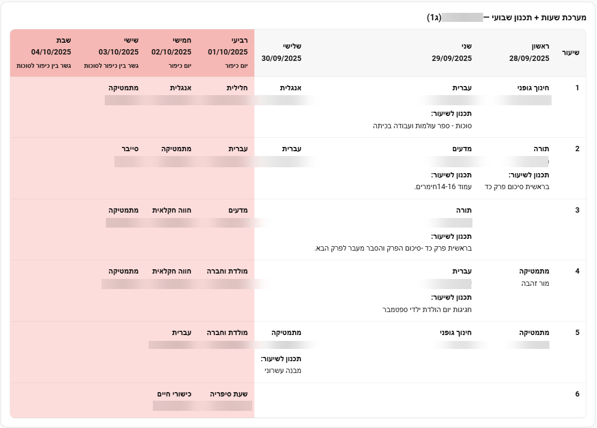
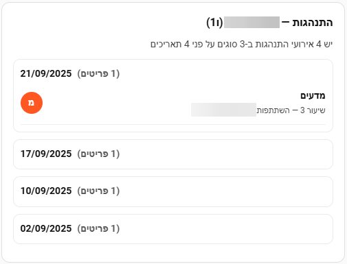
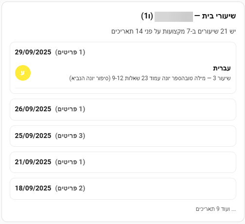

# Mashov – Home Assistant Integration (HACS)

Unofficial integration for **משו"ב (Mashov)** that logs into the student portal and exposes data as sensors:
- **Weekly Plan**
- **Homework**
- **Behavior**
- **Timetable** (weekly timetable per student)
- **Lessons History** (historical lessons/logs per student)
- **Grades**
- **Holidays** (sensor and calendar per school hub)

Current release: **v1.0.9**. Requires **Home Assistant 2025.3 or newer**.
See [release notes](RELEASE_NOTES.md) for fixes and upgrade compatibility.

> This project is **community-made** and not affiliated with Mashov. Use at your own risk and follow your school's policies.

---


## 🧩 Features
- Simple **Config Flow (UI)** via Settings → Devices & Services → Add Integration → **Mashov**.
- **Daily refresh** (02:30 by default) + `mashov.refresh_now` service for on-demand updates.
- **Sensors** expose compact **state** (count) + rich **attributes** (lists you can use in automations / dashboards).
- **Calendar entity** for school holidays - integrates with Home Assistant calendar view 📅
- **Diagnostics** endpoint for safe issue reporting (redacts credentials).

---

## 📦 Installation

### Via HACS (recommended)
1. Open **HACS → Integrations → ⋯ → Custom repositories**.
2. Add repository URL: `https://github.com/NirBY/ha-mashov`. Select **Category: Integration**.
3. Search for **Mashov** in HACS, install, and **Restart Home Assistant**.

### Manual
1. Copy `custom_components/mashov` into your HA `/config/` folder.
2. Restart Home Assistant.

> The integration includes a custom `icon.png`.

---

## ⚙️ Configuration

1. **Add Integration → Mashov**.
2. Enter **username / password**.
3. Pick your **school** from the dropdown with **fast autocomplete** (type to filter). If the list doesn't load, a text field appears; type the **school name in Hebrew** or the **Semel** and we'll resolve it.
4. Done — sensors for **each child** will be created.

### Options

To configure options, go to: **Settings → Devices & Services → Mashov → Configure**

Credential updates in **Configure** apply only to the specific Mashov hub entry you opened. If you have multiple Mashov hubs, updating one hub's username or password does **not** automatically update the others.

Duplicate accounts for the same school are detected during setup. Different accounts
can expose the same child in separate hubs without sensor unique-ID collisions.
The school year advances automatically on September 1 unless an existing entry has
an explicitly configured year; that year remains pinned.

- **Homework window**: days back (default 7), days forward (default 21)
- **Daily refresh time**: default `02:30`
- **API base**: default `https://web.mashov.info/api/` (override if your deployment differs)
- **Max items in attributes**: maximum items to store in sensor attributes (default 100, range: 10-500)
  - Controls how many recent items are stored in sensor attributes to prevent database size issues
  - Sensors automatically clean technical fields and limit size to fit within Home Assistant's 16KB limit
  - Full data is always available via `coordinator.data` for advanced automations
  - Attributes show `total_items` (all available) and `stored_items` (actually stored in attributes)

#### Important note about night-time polling
- Pulling data at night may trigger email notifications from Mashov about account activity/logins. If this is undesirable:
  - Prefer scheduling the daily/weekly refresh to daytime hours (e.g., `14:00`).
  - Use the Options screen or YAML to set `schedule_type` and `schedule_time` accordingly.
  - Avoid long-running `interval` mode during overnight hours.

### Additional student data (optional)

In **Mashov → Configure → Additional student data**, select resources separately
for each school. Nothing extra is fetched by default. Changing this selection
reloads that integration entry; data arrives at the next scheduled or manual refresh.

Available sensors count noticeboard posts, daily behavior, behavior outside lessons,
follow-up notes, term grades, report cards, study materials, student files, and
absence justification requests. Their `items` attributes contain API records or
file metadata, with the configured item limit and a 12 KB item-array limit.
`total_items` and `stored_items` show when records were omitted for size.
Files are not downloaded, messages are not marked read, and requests/forms are
never submitted. Dated resources use the configured days-back/days-forward window.

School permissions and published data vary. An empty successful result has state
`0`; access failures are `unavailable` with a `source_status` attribute. Forbidden
or unsupported resources are retried after 24 hours (or an integration reload),
independently for each student and school. The external Shahaf exam calendar,
mail, and parent approvals are not included in these sensors.

### Configuration via configuration.yaml (optional)
You can also configure the refresh schedule via YAML. Scheduling values in YAML
override the Options UI. Configure the API base, homework window, and item limit
through the Options UI.

```yaml
mashov:
  # Scheduling
  schedule_type: daily        # daily | weekly | interval
  schedule_time: "14:00"      # for daily/weekly
  schedule_day: 0             # 0=Monday ... 6=Sunday
  schedule_days: [0, 2, 4]    # optional multiple days for weekly
  schedule_interval: 120      # minutes (for interval mode)
```

---

## 🧠 Entities (per child)

For each child **N**, these sensors are created:

The IDs below are illustrative. Home Assistant assigns entity IDs from entity names
and its registry; select your actual IDs in **Settings → Devices & Services → Entities**.
Upgrading preserves existing entity IDs and history references. Internal unique IDs
are scoped to each hub automatically.

- **Weekly Plan** – `sensor.mashov_<student_id>_weekly_plan`
- **Homework** – `sensor.mashov_<student_id>_homework`
- **Behavior** – `sensor.mashov_<student_id>_behavior`
- **Timetable** – `sensor.mashov_<student_id>_timetable`
- **Lessons History** – `sensor.mashov_<student_id>_lessons_history`
- **Grades** – `sensor.mashov_<student_id>_grades`

**State** = number of items.  
**Attributes** (common): `items`, `formatted_summary`, `formatted_by_date`, `formatted_by_subject` (and for timetable: also table helpers).

Weekly-plan subjects and teachers are filled from timetable groups where available,
and grouped views include the plan text. Dated plans without weekday grid positions
do not expose an empty HTML table. Students continue updating after a class-name
change because data lookup follows their stable student ID. Update and schedule
timestamps use Home Assistant's configured timezone.

> **Tip**: Use `{{ state_attr('sensor.mashov_<id>_homework', 'items') }}` to access raw lists.
>
> **Note**: The `items` attribute contains cleaned, size-optimized recent items (technical fields removed). To see all items:
> - `total_items` = total number of items available
> - `stored_items` = number of items in the `items` attribute
> - Full raw data is always available via `coordinator.data` for advanced automations

### School hub entities

Each hub has its own holiday sensor and calendar. Select the matching school's
entities in cards and automations; IDs can have suffixes on installations with multiple hubs.
- **Holidays Sensor** – `sensor.mashov_holidays`  
  State = number of holidays. Attributes: `items`, `formatted_summary`, `formatted_by_date`.

- **Holidays Calendar** – `calendar.mashov_holidays_calendar`
  Full calendar integration for school holidays. Shows events in Home Assistant calendar view with start/end dates.  
  _Contributed by [@aviadlevy](https://github.com/aviadlevy)_

---

## 🔔 Automation Blueprint: Daily Homework & Behavior Announcement

A ready-to-use blueprint that speaks today's homework and behavior in Hebrew at a fixed time, with safe defaults and volume handling.

One‑click import (My Home Assistant):

[](https://my.home-assistant.io/redirect/blueprint_import/?blueprint_url=https%3A%2F%2Fraw.githubusercontent.com%2FNirBY%2Fha-mashov%2Fmain%2Fblueprints%2Fautomation%2Fmashov%2Fmashov_daily_homework_announce.yaml)

If you hit a cache issue when importing, use the commit‑pinned link:

[Import pinned version](https://my.home-assistant.io/redirect/blueprint_import/?blueprint_url=https%3A%2F%2Fraw.githubusercontent.com%2FNirBY%2Fha-mashov%2Fe9aade5%2Fblueprints%2Fautomation%2Fmashov%2Fmashov_daily_homework_announce.yaml)

Blueprint file location: `blueprints/automation/mashov/mashov_daily_homework_announce.yaml`.

What does it do?
- Daily voice announcement at **15:00** that reads the student’s **name**, **today’s behaviors**, and **today’s homework** (Hebrew).
- Runs **only in daytime** and **skips holidays** using your Mashov holidays sensor (`Items[start/end]`).
- Triggers **only if there is data for today** in the homework and/or behavior sensors.
- Temporarily **sets the speaker to max volume**, speaks via **`tts.speak`** (configurable), then **restores the original volume** after playback.
- Works with any `media_player` (Sonos, Nest, etc.); volume restore is state-aware.
- Fully **templated blueprint**: select your own Mashov sensors and speaker at import time.
- Safe defaults: 15:00 schedule, Hebrew (`he-IL`) TTS, 07:00–22:00 guard rails.
- GitHub-friendly: no hardcoded entity IDs; can be imported with a **My Home Assistant** one-click link.

How to use
1. Click the import button above and select your `holiday_sensor`, `homework_sensor`, `behavior_sensor`, `media_player`, and optional `tts_service`.
2. Save the automation. By default it runs every day at 15:00.

---

## 🎒 Automation Blueprint: Bag Reminder (Tomorrow's Subjects)

One‑click import (My Home Assistant):

[](https://my.home-assistant.io/redirect/blueprint_import/?blueprint_url=https%3A%2F%2Fraw.githubusercontent.com%2FNirBY%2Fha-mashov%2Fmain%2Fblueprints%2Fautomation%2Fmashov%2Fbag_reminder_tomorrow.yaml)

What does it do?
- Runs once daily at 18:00 to help a student pack their school bag for tomorrow.
- Skips automatically if it’s night-time, Saturday, or a listed holiday (from the holiday sensor).
- Reads tomorrow’s subjects only when timetable data actually exists for tomorrow.
- Builds a Hebrew TTS message: “שלום {Student}… אנא לסדר תיק למחר… {subjects + teacher names [+ plan]}”.
- Temporarily raises the speaker to a configurable max volume, then restores the previous (or fallback) volume after TTS ends.
- Pulls subjects and teacher names from the Mashov timetable; optionally appends each lesson’s “plan” from the weekly plan sensor.
- Waits for the speaker state to finish playing before restoring volume, to avoid cutting the message.
- Provides rich trace/log lines explaining why it ran or skipped (night block, Saturday, holiday, has data).

Blueprint file location: `blueprints/automation/mashov/bag_reminder_tomorrow.yaml`.

How to use
1. Click the import button above, pick your Mashov timetable sensor, (optional) weekly plan sensor, holiday sensor, media player and voice settings.
2. Save the automation. Defaults: 18:00, Hebrew, night guard 22:00–07:00.

---

## 🛠️ Services

### `mashov.refresh_now`
Trigger an immediate refresh.
```yaml
service: mashov.refresh_now
data:
  entry_id: YOUR_ENTRY_ID  # optional; if omitted, all entries refresh
```

Calling without `entry_id` refreshes all configured Mashov hubs.

### `mashov.set_options`

Update a hub's options without opening Configure:

```yaml
service: mashov.set_options
data:
  entry_id: YOUR_ENTRY_ID
  schedule_type: weekly
  schedule_time: "14:00"
  schedule_days: [0, 2, 4]  # Monday, Wednesday, Friday
```

For backward compatibility, omitting `entry_id` targets the first loaded hub.
Specify it when selecting a particular hub. The legacy `schedule_day` field remains
supported; supplying it without `schedule_days` replaces the selected days with
that one day. Invalid service inputs are rejected. YAML scheduling overrides still apply.

---

## 🧱 Lovelace Cards (Examples)
You can quickly add cards to display Mashov data. Use `!include` to import ready-made cards.

Files:
- `examples/lovelace/cards/weekly_plan_table_advanced.yaml`
- `examples/lovelace/cards/behavior_list_by_date.yaml`
- `examples/lovelace/cards/homework_list_by_date.yaml`
- `examples/lovelace/cards/refresh_all_button.yaml`

Copy these files into your Home Assistant config at `/config/lovelace/cards/examples/`, then reference them like this:

Note: HACS installs only `custom_components/`. Copy the example card files to your `/config/examples/` (or paste the YAML into UI cards) if you want to use `!include`.

Advanced weekly plan (table) via include:
```yaml
views:
  - title: Mashov
    cards:
      - !include lovelace/cards/examples/weekly_plan_table_advanced.yaml
```
Example preview:

<p align="left"></p>

Behavior events grouped by date:
```yaml
views:
  - title: Mashov
    cards:
      - !include lovelace/cards/examples/behavior_list_by_date.yaml
```
Example preview:

<p align="left"></p>

Homework grouped by date:
```yaml
views:
  - title: Mashov
    cards:
      - !include lovelace/cards/examples/homework_list_by_date.yaml
```
Example preview:

<p align="left"></p>

Refresh all hubs button:
```yaml
views:
  - title: Mashov
    cards:
      - !include lovelace/cards/examples/refresh_all_button.yaml
```

## 🔍 Troubleshooting

- **401 / authentication failures**: check credentials and school choice, and update credentials through **Configure**. Password-change responses display a link to the Mashov login page.
- **403 / school-disabled resources**: core resources such as weekly plan retry after 1 hour, then 6 hours, then 24 hours. Each student's resource has its own cooldown, which resets after success. Optional resources use a separate 24-hour cooldown. A school permission denial does not necessarily mean the password is wrong.
- **Startup connection failures**: HA retries transient setup failures when no cached data is available. When cached data exists, the integration retains it until a refresh succeeds.
- **Different host**: open **Options → API base** and paste the base prefix you see in your browser DevTools Network tab (up to `/api/`).  
  Common defaults: `https://web.mashov.info/api/`, sometimes `https://mobileapi.mashov.info/api/`.
- **No schools in dropdown**: temporary catalog issue — the flow falls back to text; enter the name or Semel to resolve.
- **Autocomplete not working**: suggestions are limited to 50 schools; type the school name or Semel to search beyond those suggestions.
- **Multiple kids missing**: ensure your account actually lists multiple students in Mashov. Check HA logs for `custom_components.mashov` debug entries.
- **Session errors**: if you see "Unclosed client session" errors, restart Home Assistant to clear any stale connections.
- **"New Device" emails**: session persistence reduces unnecessary logins but cannot prevent fresh authentication after a server-side session expiry. Authentication is saved after successful refreshes in `.storage/mashov.<entry_id>.cache`. Avoid unnecessary reloads and never share this file; it contains authentication data.

### Notifications, GitHub, Telegram and GreenAPI

Authentication and full-refresh failures create a persistent notification in the HA
UI. A successful refresh dismisses that hub's notification. The GitHub link opens a
prefilled issue form for you to review and submit; publishing or closing an issue
on GitHub does not synchronize its status back into HA.

The integration does not include GitHub issue monitoring or automatic Telegram/
GreenAPI delivery. Configure those separately if needed. To forward HA notifications,
use a `persistent_notification` trigger for added/updated notifications; listening
only for calls to the `persistent_notification.create` service misses notifications
created directly by integration code. For HACS release alerts, monitor the relevant
`update` entities rather than relying on the legacy `sensor.hacs` entity.

### Enable debug logs
```yaml
logger:
  logs:
    custom_components.mashov: debug
```

---

## 🔐 Privacy & Security
- Credentials are stored by Home Assistant in the config entry store.
- The integration mirrors the Mashov web client behavior (headers, cookies, API calls). Endpoints may change without notice.
- Before sharing logs, screenshots, or diagnostics in GitHub issues, review them and remove personal data such as usernames, student names, IDs, grades, homework text, session cookies, tokens, phone numbers, email addresses, and any other sensitive school or account details.
- If you are unsure whether something is safe to share, redact it first. Only upload the minimum data needed to reproduce the problem.

---

## 📄 License
MIT © 2025


---

## 📜 Changelog
See the full changelog in `CHANGELOG.md`.


## v1.0.8: holidays, diagnostics and reporting

Requires Home Assistant **2025.3 or newer**. Restart HA after installing an update.
The regular timetable remains a weekly template. Holiday marking is provided by the
card using the holiday sensor belonging to the student's school. Update both the card's
`entities` list and `holId` / `HL` variable; see [updated examples](examples/lovelace/README.md).

In the two-school example, Ahad Haam uses `sensor.mashov_holidays_2` and Naomi Shemer
uses `sensor.mashov_holidays_mashov_holidays`. IDs depend on your entity registry.

Authentication and full refresh failures create a persistent notification in HA.
**Review a bug report on GitHub** opens a prefilled form with versions and a technical
event summary. Review, describe the problem and submit on GitHub. This does not publish
anything automatically or upload the HA log. Download integration diagnostics for
additional counts/statuses; diagnostics exclude student records, credentials and entry data.
School-denied optional resources expose `source_status` without repeated failure notifications.

Debug logs can still contain operational context; review existing or manually attached logs.
Never attach raw portal captures or a complete HA log without reviewing personal information.
Raw HTML examples are stored locally under ignored `dataExample/html/`; checked-in examples
use synthetic records. Redacted screenshots remain in the repository.

Development: use Python 3.13/3.14 and the test requirements. On Windows run
`python run_tests.py -q`; the wrapper supplies Unix-only test stubs and permits loopback
for asyncio while keeping external socket connections blocked. Use a compatible
pyOpenSSL/cryptography installation; SSL itself is not mocked.

See [release notes](RELEASE_NOTES.md) and [changelog](CHANGELOG.md).

The project uses the [MIT license](LICENSE); see also the [project notice](NOTICE.md).

Sensor attributes are bounded as a complete JSON payload. If `formatting_truncated` is
true, duplicate formatted groups/HTML may be empty so raw records can fit. If
`items_truncated` is true, compare `stored_items` with `total_items`; the coordinator
retains the full fetched dataset. A single oversized item may be omitted entirely.

## v1.0.9: reliability and upgrade compatibility

Upgrade in HACS and restart Home Assistant. Existing entity IDs and settings are
preserved automatically, including when a student appears in multiple hubs.
Disabled core resources now retry after 1h/6h/24h rather than on every refresh.
Setup reads version metadata already loaded by HA without blocking file reads.
Account setup retains the selected school, closes failed validation sessions, and
applies credential/options changes with one reload. Holiday timestamps with timezone
offsets are supported, and unloading failures preserve the active client and timers.
See [release notes](RELEASE_NOTES.md) for the full fixes and compatibility details.

`mashov.set_options` accepts an optional `entry_id` to choose a hub. For backward
compatibility, omitting it targets the first loaded hub. `mashov.refresh_now`
continues to refresh every hub when `entry_id` is omitted. The legacy
`schedule_day` service field remains supported and replaces the selected days.
