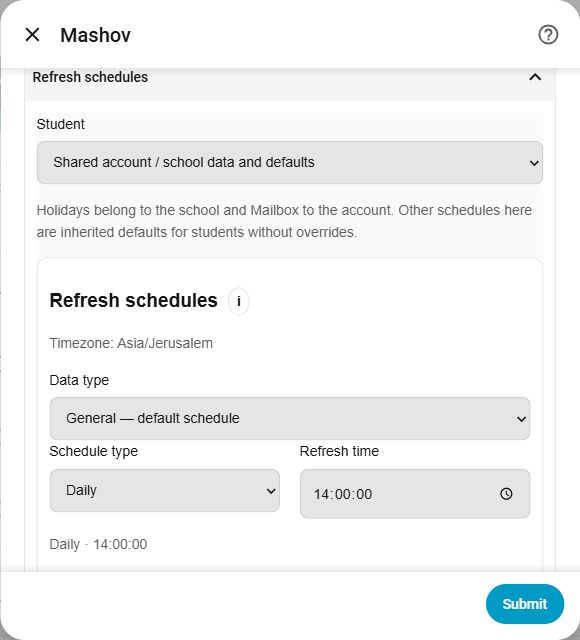
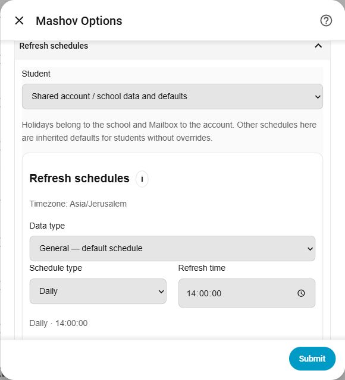

[← README](../README.md#options)

# Configuration picture examples

These show the current inline schedule editor. Shared scope is selected to keep personal student names out of the pictures. Account fields are empty or collapsed. School-provided content retains its original language.

## Hub registration

Enter account details, choose Data to fetch and set initial defaults in Refresh schedules. Student-specific schedules become available after authentication loads the roster.

## Configure an existing hub

Select Student, then General or a data type. Disable inheritance to customize it. Switching types and students retains the draft; the native form’s Submit saves every edit together.

