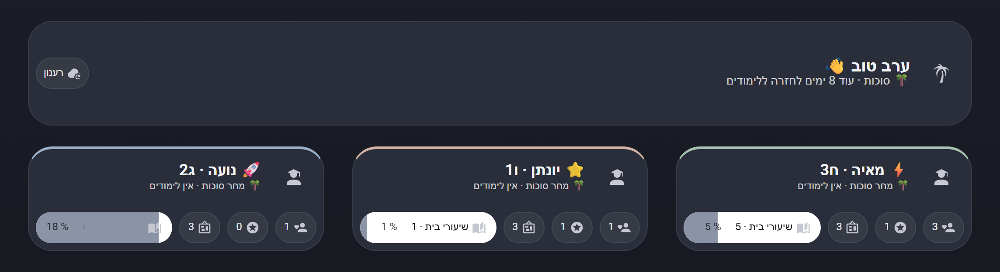
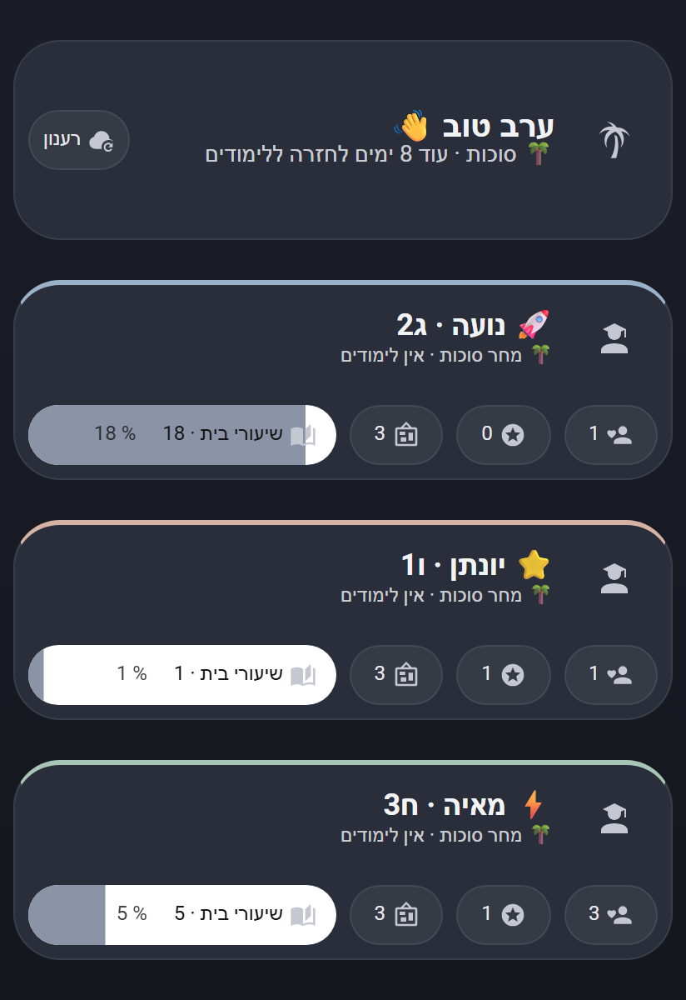

[← README](../README.md) · [Automation blueprints](blueprints.md) · [Services](services.md)

# Mashov Live dashboard

One‑click import (My Home Assistant):

## What it shows
- A greeting card with the current holiday countdown (or days until the next holiday) and a refresh button.
- One quiet card per student, showing the linked person's photo, a live "tomorrow" line (holiday, or the number of lessons and first subjects; on Friday it shows Sunday's bag or holiday, unless the timetable has Saturday lessons), behavior, grades and notice counts, and a homework bar.
- A pop-up per student with the next school day's lessons (teacher and room; Sunday's on Friday), recent homework, behavior, grades, notices and the school calendar.
- Hebrew right‑to‑left layout, with English words and numbers kept left‑to‑right.

## Visibility
- **Family** (people selected in the General section) see every card.
- Each student card is also visible to the **linked person** and any **extra viewers**, so a child who logs in sees only their own card.
- A child found automatically, with no linked person and no extra viewers, is visible only to the family. Choose at least one family member, or link that child to a person who has a Home Assistant user.
- Only people linked to a Home Assistant user can be used for visibility. This hides cards in the dashboard; it does not restrict access to the underlying entities.

## Requirements
- Bubble Card 3.4 or newer (HACS → Frontend).
- An empty UI dashboard: **Settings → Dashboards → Add dashboard → New dashboard from scratch**. Note its URL (for example `mashov-live`).

## Setup
1. Click the import button above and create a script from the blueprint.
2. Enter the dashboard URL and the family members. Every child on every Mashov hub is included, with the name, class and sensors the integration already created. The four student sections are optional: type a child's name to set an emoji, color, linked person or extra viewers. Empty sections are skipped.
3. Save and run the script. Run it again after a new child is added; you do not need to edit the script.

The script only writes into a dashboard that is empty or that it built itself. To replace a dashboard
that has other content, or a built-in one such as the Overview (`lovelace`), turn on **Replace existing
content**; the previous content is lost. Only administrators can run the service.

Blueprint file location: `blueprints/script/mashov/mashov_live_dashboard.yaml`.

---

## Picture examples

Desktop layout with fictitious student names:

Mobile layout:

For individual timetable, homework and behavior cards, see the [Lovelace card examples](../examples/lovelace/README.md).
