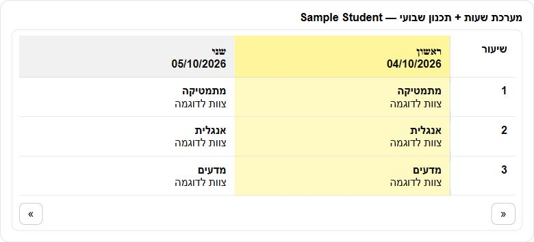

# Mashov example cards

| File | What it shows | Custom cards needed |
| --- | --- | --- |
| `cards/homework_list_by_date.yaml` | Homework grouped by date, newest first | config-template-card, html-card |
| `cards/behavior_list_by_date.yaml` | Behavior events grouped by date, newest first | config-template-card, html-card |
| `cards/weekly_plan_table_advanced.yaml` | This week's timetable with lesson plans and holidays | config-template-card, html-card |
| `cards/weekly_plan_table_dynamic.yaml` | The same data, two days at a time with ◀ ▶ paging (mobile friendly) | config-template-card, html-card |
| `cards/refresh_all_button.yaml` | A button that refreshes all Mashov hubs | none |

## Adding a card

- **UI dashboard (the default):** edit the dashboard → **Add card** → **Manual**, and paste
  the whole file. `!include` does not work in UI dashboards.
- **YAML dashboard:** copy the files to `/config/lovelace/cards/examples/` and include them,
  for example `- !include lovelace/cards/examples/homework_list_by_date.yaml`.

Install the custom cards from HACS → Frontend and make sure they are listed as `module`
resources in **Settings → Dashboards → Resources**:

- `/hacsfiles/config-template-card/config-template-card.js`
- `/hacsfiles/html-card/html-card.js`

## Choosing the entity IDs

Every placeholder appears twice in a card: once in `entities` and once inside the
JavaScript. Replace both.

| Placeholder | Replace with | Find it in Developer Tools → States by filtering |
| --- | --- | --- |
| `sensor.mashov_<studentID>_homework` | the student's homework sensor | `homework` |
| `sensor.mashov_<studentID>_behavior` | the student's behavior sensor | `behavior` |
| `sensor.mashov_<studentID>_timetable` | the student's timetable sensor | `timetable` |
| `sensor.mashov_<studentID>_weekly_plan` | the student's weekly plan sensor | `weekly_plan` |
| `sensor.<school_holidays_entity>` | the holiday sensor of **the student's own school hub** | `holidays` |

Entity IDs depend on when each entity was first created. Upgrades keep existing IDs, so
check your own installation instead of copying IDs from elsewhere. On a new installation
the holiday sensor is named after the school, for example
`sensor.mashov_<school>_holidays_count`, and each hub has its own. Older installations may
use `sensor.mashov_holidays`, `sensor.mashov_holidays_2`, and so on.

## How the cards read the data

- **Homework and behavior** read the structured `items` attribute. If `items` is empty they
  fall back to `formatted_by_date`. Text from Mashov is HTML-escaped before display.
- **Timetable** is the recurring school week. `timeTable.day` uses Mashov's numbering,
  1 = Sunday through 7 = Saturday.
- **Holidays**: the sensor's `end` date is inclusive. An all-day calendar event's end is
  exclusive, so a holiday ending 2026-10-03 appears in the calendar as ending 2026-10-04.
  The weekly cards highlight holidays but still show the regular lessons underneath; they
  do not claim those lessons take place.
- **Attribute size**: each sensor keeps its attributes under Home Assistant's size limit.
  When a list is long, `stored_items` is smaller than `total_items` and the oldest entries
  are left out of `items`.

A sensor whose source is not available to your school (for example a weekly plan the
school has disabled) has state `unknown`, `source_status: forbidden` and an empty `items`
list. The cards then show "אין נתונים להצגה" (no data to display).

Synthetic holiday fixture (no account or student information):

```json
{"items": [{"name": "סוכות", "start": "2026-09-25", "end": "2026-10-03"}]}
```

Local portal HTML captures belong in the ignored `dataExample/html/` folder, never in Git.


## Picture examples

These existing screenshots show the card layouts with personal names redacted. School content is displayed in its original language.

### Homework by date

[Card YAML](cards/homework_list_by_date.yaml)


### Behavior by date

[Card YAML](cards/behavior_list_by_date.yaml)


### Weekly timetable and plans

[Card YAML](cards/weekly_plan_table_advanced.yaml)


### Two-day timetable with paging

[Card YAML](cards/weekly_plan_table_dynamic.yaml). Shows the timetable/plan data two days at a time, with previous/next controls. The picture below was rendered from this exact template using fictional sample records.



### Refresh button

[Card YAML](cards/refresh_all_button.yaml). A single tap requests a refresh of all hubs. The refresh control is also pictured in the [Mashov Live desktop example](../../docs/dashboard.md#picture-examples).
